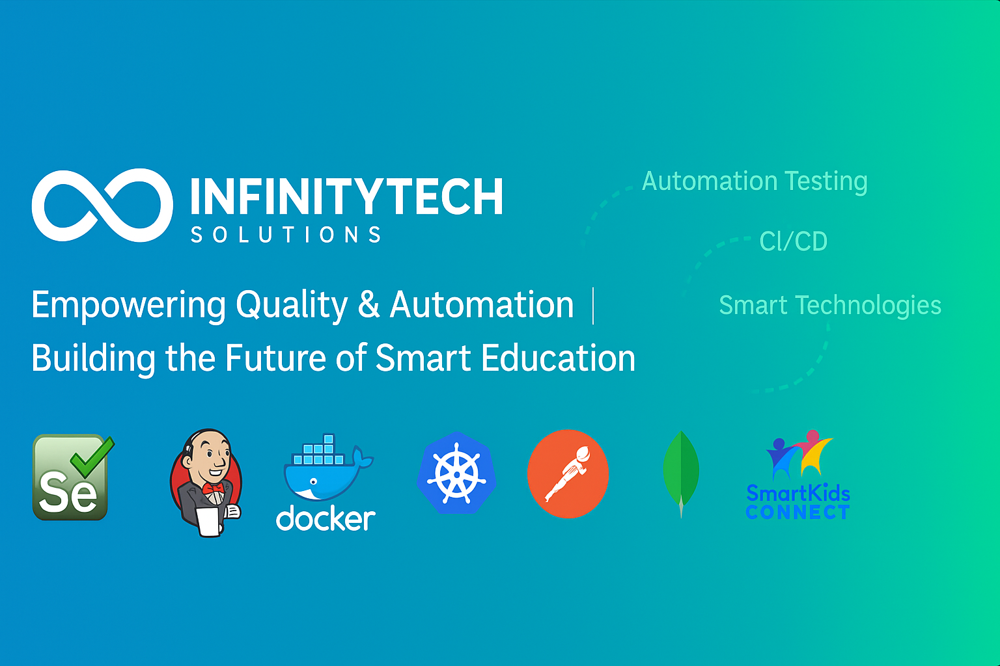

# 👋 Hi there, I'm Nader Ben Chaaben welcome to my profile.
💡 **QA Engineer | Automation Expert | Tech Trainer**  
🌎 **Based in Lodz, Poland | Originally from Tunisia**  
🔎 **Passionate about Test Automation, CI/CD, AI Solutions, and Scalable Web Applications**  

---

## 🚀 I'm currently working on:
- [SmartKids Connect](https://github.com/InfinityTech-SmartKids) - An AI-powered education platform.
- [DXC Transport Tracking](https://github.com/InfinityTech-DXC) - Transport management and tracking solution.

---

## 📚 I'm currently learning:
- AI-driven Test Automation (Self-healing tests, Predictive analysis)
- Model-based Testing and Test Optimization  
- Advanced Jenkins CI/CD pipelines with AI integration  
- Geospatial data processing with GeoPandas  
- Microservices architecture in Node.js & FastAPI  
- Autonomous Test Execution and AI-based Test Prioritization    

---

## 💡 Technologies & Tools:

### **Programming Languages & Technologies:**  
              

---

### **Automation:**  
         

---

### **Game & Map Testing:**  
     

---

### **Blockchain & Crypto:**  
     

---

### **Finance & Banking:**  
     

---

### **ERP & Business Solutions:**  
    

---

### **Artificial Intelligence & Machine Learning:**  
       

---

### **Cloud & DevOps Solutions:**  
           

---

## 📫 How to reach me:
- ✉️ Email: [chaben.nader@gmail.com](mailto:chaben.nader@gmail.com)  
- 🔗 LinkedIn: [Nader Ben Chabane](https://www.linkedin.com/in/nader-ben-chabane)  
- 🌐 Website: [InfinityTech Solutions](https://infinitytech-solutions.com)  

---

## 🌟 GitHub Stats:

  
  

  
  

---

## ✨ **Quote:**  
*"Quality is never an accident; it is always the result of intelligent effort."* – John Ruskin  
=======
